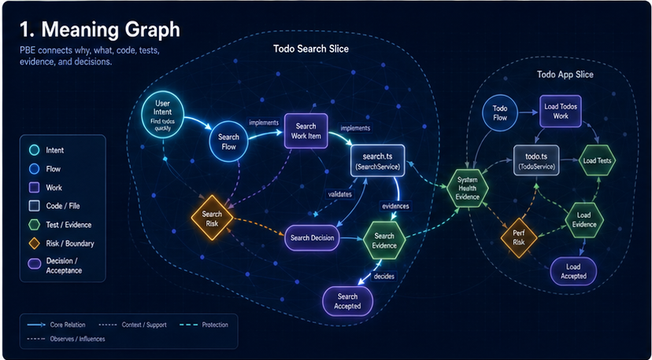
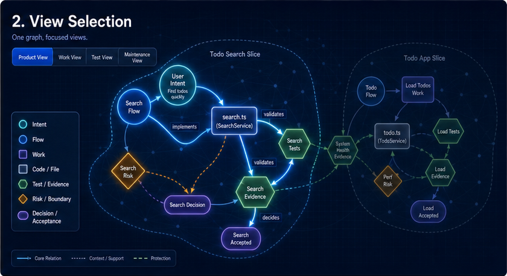
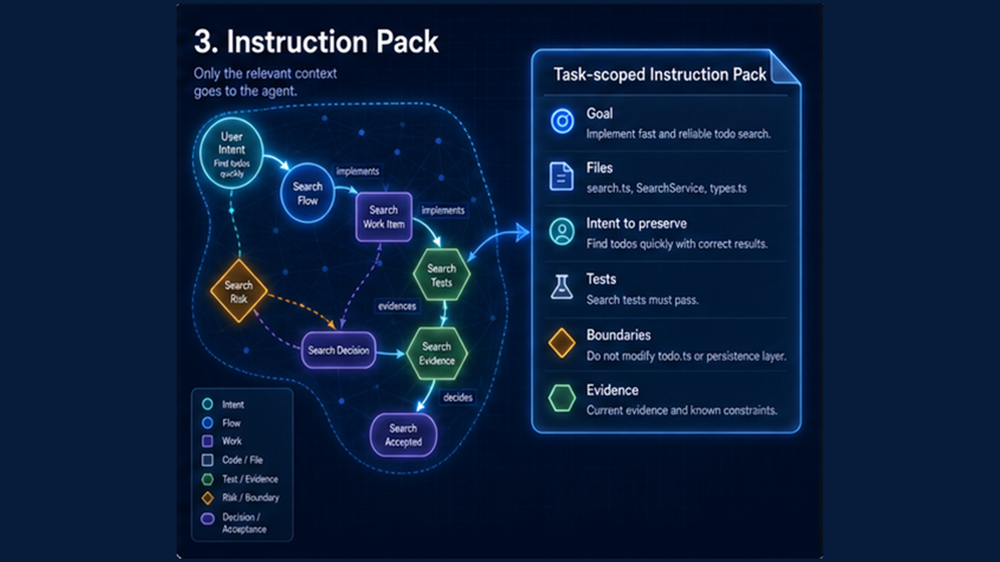
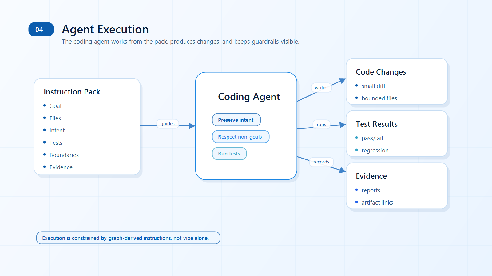
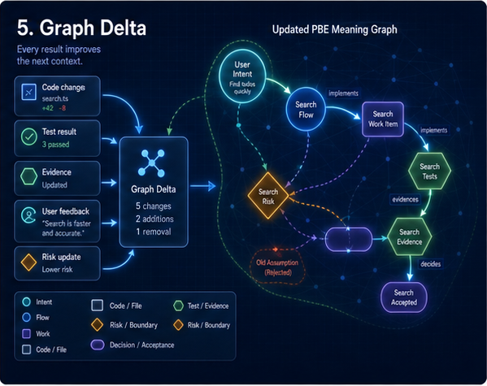

# Project Blueprint Engine

Project Blueprint Engine (PBE) helps Codex keep product intent, implementation work, tests, evidence, risk, and human
decisions connected while a project changes.

## Why PBE Exists

AI coding can move quickly, but maintenance often fails for a quieter reason: the "why" gets separated from the code.

A useful change may still lose the original user intent, skip a boundary, forget which tests prove the behavior, or
treat a reviewer decision as implied approval. PBE is a control layer for that problem. It is designed to make
AI-assisted development slower when it needs to be safer, clearer, and reviewable.

PBE is not a GUI, SaaS product, API provider, daemon, or general execution engine. It is a Codex plugin workflow plus
deterministic CLI checks that read and write local project artifacts.

## The Core Idea

PBE treats the project as a meaning graph. User intent, product flow, work, code, tests, evidence, risks, and decisions
stay linked instead of becoming disconnected notes.

The graph is the source of meaning. Views derived from it can be small and task-specific, but they still preserve
traceability back to the user's goal.

## How It Works

### 1. Meaning Graph

PBE starts by keeping intent, flow, code, tests, evidence, risk, and decisions connected as one graph.



### 2. View Selection

For a current slice, PBE narrows the graph to the nodes and edges needed for that work. Hidden context remains context,
not permission to drift.



### 3. Instruction Pack

The selected view becomes a bounded instruction pack for Codex: goal, expected files, forbidden files, intent claims,
non-goals, tests to run, and evidence to attach.



### 4. Agent Execution

Codex works from the pack, makes bounded changes, runs the required checks, and records proof instead of relying on a
vague "looks done" claim.



### 5. Graph Delta

The result comes back as code changes plus a graph delta: evidence, risk updates, decision notes, and any scope changes
that need review.



Human decisions remain explicit throughout the flow. PBE can recommend and validate, but it should not silently approve
product meaning, UI/UX, implementation scope, architecture runway, review results, acceptance, enforcement, or
retirement of old structures.

## Current Implementation Status

The repo currently contains graph-source-backed examples, read-model projection checks, local E2E smoke coverage, and
non-enforcing CI observation records.

Current boundaries:

- Graph-source read-model examples are observable and testable.
- `validate-all` evidence exists for configured slices, but it is non-enforcing.
- Todo Search tree-native selected-slice artifacts are deprecated fallback/reference records, not source, and remain
  available for rollback.
- CI artifacts are informational unless a future approved change makes them required.
- Todo App and repo-wide tree-native retirement are not ready; no tree-native files have been deleted.
- No required check, enforcement behavior, source-authority expansion, or tree retirement should be introduced without
  explicit approval.

## Artifact Map

When PBE is initialized in a project, it stores local control artifacts under `.pbe/`:

- `.pbe/tree/`: product, project, work, and test trees.
- `.pbe/execution/`: cycle contracts and node execution contracts.
- `.pbe/control/`: decisions, changes, impact, acceptance, and UI/control ledgers.
- `.pbe/evidence/`: proof records linked back to work, tests, and acceptance criteria.
- `.pbe/blueprint/`: compatibility views for older workflows.

Compatibility names still appear in docs and commands: RPD grows product intent, WPD derives project/work shape, VD
derives verification, and ACEP packages an executable cycle for Codex. These names are compatibility/control-layer
terms; graph-source and read-model artifacts remain the forward source-authority direction where explicitly configured.

## Quick Commands

Install dependencies first:

```bash
npm install
```

Build the CLI and run the main PBE validator:

```bash
npm run validate:pbe
```

Validate the v2 tree system schemas and examples:

```bash
npm run validate:pbe:v2
```

Run the graph-source read-model E2E smoke:

```bash
npm run test:read-model:e2e
```

Build the CLI, then generate the graph-source health report:

```bash
npm run build:cli
node dist/cli/index.js graph read-model report-health --json --markdown examples/read-model-aggregate/generated/read-model-health-report-output.md
```

Project or report intent from a graph source:

```bash
node dist/cli/index.js graph read-model project-intent --graph-source examples/valid/todo-app-pbe-run/graph-source.json --output .tmp/todo-app-intent.json --json
node dist/cli/index.js graph read-model report-intent --graph-source examples/valid/todo-app-pbe-run/graph-source.json --json
```

Preview a graph update proposal before applying it to graph-source:

```bash
node dist/cli/index.js graph operation apply-proposal --proposal outputs/retrofit/open-source/escape-html/graph-update-proposals/symbol-stringification.graph-update-proposal.json --json
```

Preview the local operation-chain wrapper without needing to know the script path:

```bash
node dist/cli/index.js graph operation run-chain --dry-run --json
```

Inspect a retrofit graph before implementation, without touching the target project:

```bash
node dist/cli/index.js graph retrofit plan --graph-source examples/retrofit/cardprinterconfig/graph-source.json --json
```

Run the graph operation chain as CLI steps:

```bash
node dist/cli/index.js graph operation generate-pack --graph-source examples/retrofit/cardprinterconfig/graph-source.json --record change.laminator-tag-layout --json
node dist/cli/index.js graph operation capture-delta --graph-source examples/retrofit/cardprinterconfig/graph-source.json --instruction-pack outputs/retrofit/instruction-packs/laminator-tag-layout.instruction-pack.json --target-repo C:/path/to/target --json
node dist/cli/index.js graph operation propose-update --graph-delta outputs/retrofit/graph-deltas/example.graph-delta.json --json
```

## Where To Go Next

- [Documentation index](docs/index.md)
- [Install PBE locally](docs/install.md)
- [CLI reference](docs/cli-reference.md)
- [Core concepts](docs/core-concepts.md)
- [Tree control system](docs/tree-control-system.md)
- [Current graph-source transition mechanics](docs/concept/repo-wide-graph-source-transition-mechanics.md)
- [Tree-native retirement approval package](docs/concept/tree-native-retirement-approval-package.md)
- [Known limits](docs/known-limits.md)
- [Examples index](examples/README.md)

## Boundaries

PBE is intentionally conservative:

- Do not derive executable work from ambiguous product intent.
- Do not close work without test and evidence links.
- Do not treat CI or local validation as user acceptance.
- Do not make graph-source observation into enforcement without approval.
- Do not retire tree or compatibility structures without an explicit retirement decision.

The short version: PBE is for keeping Codex work connected to meaning, proof, and human decisions.
