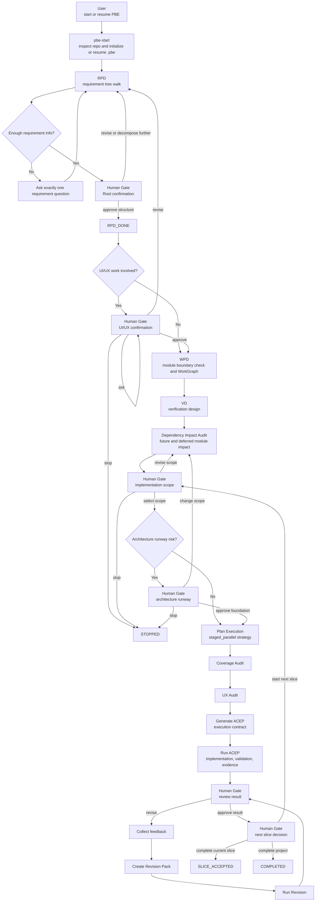
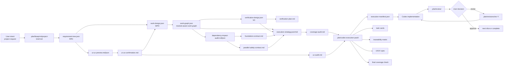
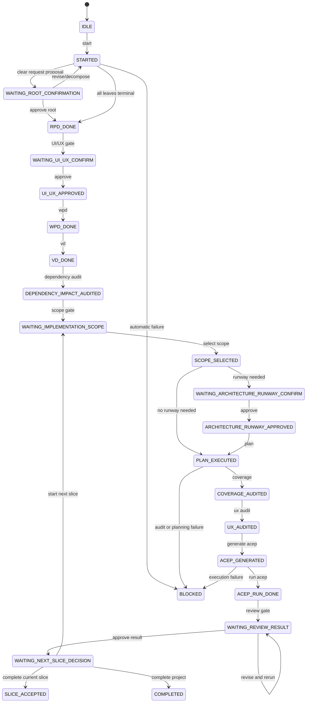

# Project Blueprint Engine

Project Blueprint Engine is a Codex Plugin and an evolving tree-based development control system.

It does not provide a GUI, SaaS backend, or separate OpenAI API provider. It runs inside Codex as a set of skills, stores durable artifacts in `.pbe/`, generates execution contracts, and guides Codex through those contracts until a human gate or stop condition.

PBE is optimized for safe, reviewable, staged project construction, not for speed.

## The Problem PBE Solves

Ordinary AI coding can jump from a user request straight into code. That is fast, but it can lose the chain between product intent, implementation scope, tests, evidence, user review, and later revision impact.

PBE turns that chain into a durable Codex development control protocol:

- Requirements become Product Tree nodes.
- Product branches derive Project, Work, and Test nodes.
- Selected work is packaged into Cycle and Node Execution Contracts.
- Validation and evidence attach back to the nodes they prove.
- User feedback becomes Change and Impact nodes before revision work starts.
- Only the user can accept product results.

## 30-Second Summary

Run PBE when a project needs controlled construction rather than a quick edit.

```text
@project-blueprint-engine start
```

PBE then walks the product intent, builds tree artifacts under `.pbe/`, stops for human gates when product judgment is needed, creates execution contracts for Codex, runs only selected/foundation scope, records evidence, and submits the result for user review.

## Quick Start

1. Install or update the plugin from your personal Codex marketplace.
2. Open a target project in Codex.
3. Start the workflow:

```text
@project-blueprint-engine start
```

You do not need to memorize every command. At gates, PBE reports the current state and gives natural-language examples such as:

```text
approve
continue with the recommended scope
defer login settings to the next slice
change the empty-state copy before implementation
what is risky here?
stop
```

The detailed installation and use guide is in [docs/usage.md](docs/usage.md). A complete example run is in [examples/todo-app-pbe-run](examples/todo-app-pbe-run/README.md).

## Learn The Model

- [Core concepts](docs/core-concepts.md)
- [Tree model](docs/tree-model.md)
- [Human gates](docs/human-gates.md)
- [Execution contracts](docs/execution-contracts.md)
- [Revision flow](docs/revision-flow.md)
- [Validator design](docs/validator-design.md)
- [Release policy](RELEASE.md)

## What Gets Created

PBE writes durable project-control artifacts into the target repository:

- `.pbe/tree/*`: Product, Project, Work, and Test trees.
- `.pbe/execution/*`: Cycle selection, contracts, execution history, and node execution contracts.
- `.pbe/control/*`: human decisions, changes, impact analysis, acceptance, and optional parity/completeness ledgers.
- `.pbe/evidence/*`: evidence tree plus logs, screenshots, test results, and review reports.
- `.pbe/blueprint/*`: compatibility views for older RPD/WPD/VD/ACEP artifacts.
- `.pbe/codex-execution-pack/*`: ACEP compatibility package for Codex execution.

## Official `.pbe` Layout

The official v2 layout is tree-native and additive. Public v1 paths are preserved as compatibility views, not removed aliases.

```text
.pbe/
  tree/
    product-tree.json
    project-tree.json
    work-tree.json
    test-tree.json

  execution/
    cycle-tree.json
    cycle-contract.md
    node-execution-contracts/

  control/
    decision-queue.json
    change-tree.json
    impact-tree.json
    acceptance-tree.json
    legacy-control-inventory.json
    surface-completion-ledger.json
    hardware-readiness-ledger.json
    visual-verification-profile.json
    verification-miss-log.json

  evidence/
    evidence-tree.json
    screenshots/
    test-results/
    logs/
    review-reports/

  blueprint/
    # backward-compatible v1 aliases and human-readable views

  codex-execution-pack/
    # ACEP compatibility package
```

## Execution Model

PBE has three layers:

- Skill Protocol: Codex skills define how RPD, WPD, VD, ACEP, review, feedback, and revision must behave.
- Persistent Artifacts: `.pbe/` files make decisions, scope, contracts, evidence, and acceptance auditable across chats.
- Validators: repository scripts check plugin structure, schemas, examples, WorkGraph safety, ACEP manifests, revision boundaries, and compatibility artifacts.

This repository is the plugin and protocol definition. It is not a standalone backend service.

## Core Idea

PBE v2 reframes the existing staged workflow around one operating model:

```text
Product Tree -> Project Tree -> Work Tree -> Test Tree
            -> Cycle Tree -> Change Tree -> Impact Tree -> Evidence Tree -> Acceptance Tree
```

Everything executable should be a tree node or a tree-derived view.

- Product Tree: what the product must mean and do for the user.
- Project Tree: module ownership, surfaces, contracts, and responsibility boundaries.
- Work Tree: executable work needed for selected branches.
- Test Tree: verification of Product and Work nodes.
- Cycle Tree: the selected slice for the current implementation cycle.
- Change Tree: development-time discoveries, feedback, and scope changes.
- Impact Tree: affected nodes that become stale, invalidated, or reopened.
- Evidence Tree: tests, screenshots, logs, diffs, and review artifacts attached to nodes.
- Acceptance Tree: user-controlled branch closure.
- Parity/Completeness controls: optional derived ledgers for legacy inventory, surface completion, visual/runtime checks, hardware readiness, and repeated verification misses.

During migration, the existing RPD/WPD/VD/ACEP terms remain supported as compatibility names:

```text
RPD  = Product Tree growth
WPD  = Project Tree + Work Tree derivation
VD   = Test Tree derivation
ACEP = Cycle Contract and Node Execution Contract packaging
Revision = Change Tree + Impact Tree + Reopen protocol
```

## Core Invariants

```text
If it is not in the Product Tree, it is not product scope.
If it changes product meaning, scope, UX, risk, acceptance, or verification, it must be a Change Node.
If work is not derived from Product/Project nodes, it is not executable work.
If a test does not verify Product/Work nodes, it is not sufficient verification.
If evidence does not attach to Test/Product nodes, it does not close the branch.
If a change invalidates completed work, affected nodes reopen instead of being silently overwritten.
If a command opens another surface, command mapping does not complete the opened workflow.
If a control, event handler, hardware action, or workflow state was not checked, it must be reported as not checked and may block closure.
```

## What PBE Produces

PBE is not only a task-card generator. It creates a traceable tree-linked execution contract:

- Product Tree / RPD requirement-tree compatibility view
- Source of Truth Matrix
- PBE Invariants
- Foundation Contract
- Project Tree and Work Tree / WPD WorkGraph compatibility views
- Test Tree / VD verification design compatibility view
- UI/UX confirmation and UI/UX spec
- Cycle Slice / staged execution strategy
- Change Tree and Impact Tree for safe revisions
- parity/completeness ledgers for legacy migration, UI-heavy parity, and hardware-dependent work
- staged parallel execution strategy
- traceability matrix
- evidence requirements
- final coverage check
- result review and bounded revision flow

## Plugin Structure

```text
.codex-plugin/
  plugin.json
skills/
  pbe-autoflow/
  pbe-start/
  pbe-rpd/
  pbe-ui-ux-confirm/
  pbe-wpd/
  pbe-vd/
  pbe-dependency-impact-audit/
  pbe-plan-execution/
  pbe-coverage-audit/
  pbe-ux-audit/
  pbe-generate-acep/
  pbe-run-acep/
  pbe-review-result/
  pbe-collect-feedback/
  pbe-create-revision-pack/
  pbe-run-revision/
templates/
schemas/
docs/
scripts/
```

## Legacy GUI Status

The old React/Vite GUI is deprecated. It remains in the repository only as legacy source and test history, guarded by `legacy:*` npm scripts. The active product direction is the Codex Plugin workflow in `.codex-plugin/`, `skills/`, `templates/`, `schemas/`, `docs/`, and `scripts/`.

Do not use the legacy GUI, API-provider, or SaaS direction as the basis for new PBE work unless the product direction is explicitly changed.

## Repository Artifact Layout

The v2 target layout is additive. Existing `.pbe/blueprint/*` files stay as compatibility aliases or human-readable views while tree-native artifacts are introduced.

```text
.pbe/
  tree/
    product-tree.json
    project-tree.json
    work-tree.json
    test-tree.json

  execution/
    cycle-tree.json
    cycle-contract.md
    node-execution-contracts/

  control/
    decision-queue.json
    change-tree.json
    impact-tree.json
    acceptance-tree.json
    legacy-control-inventory.json
    surface-completion-ledger.json
    hardware-readiness-ledger.json
    visual-verification-profile.json
    verification-miss-log.json

  evidence/
    evidence-tree.json
    screenshots/
    test-results/
    logs/

  blueprint/
    # backward-compatible v1 aliases and human-readable views
```

## Usage

In Codex, start with:

```text
@project-blueprint-engine start
```

After that, deterministic stages continue automatically. PBE stops at human judgment gates and accepts natural-language responses:

```text
approve
looks good, continue
select scope: implement USB status only
defer Ethernet to the next slice
create the foundation interface first
fix only the failed case and rerun
current status please
stop
```

The old step-by-step commands remain supported for manual control.

## How PBE Runs

PBE is easiest to understand as a stateful Codex workflow:

1. Codex reads the target repository and the existing `.pbe/` folder.
2. PBE stores durable state in `.pbe/blueprint/pbe-state.json`.
3. PBE routing reads that state before implementation or deliverable-producing work.
4. Deterministic stages continue automatically.
5. Human gates stop the flow only when product judgment is required.
6. ACEP/Cycle Contract turns the approved plan into a Codex execution contract.
7. Codex implements only selected and approved foundation scope.
8. The user, not Codex, decides whether the result is accepted.



## Human Gates

PBE stops only where the user has to make a product or delivery decision.

| Gate | Why PBE Stops | Typical User Replies |
| --- | --- | --- |
| Root confirmation | Even a clear request must be summarized and structurally confirmed before RPD ends. | `use this structure`, `revise the audience`, `decompose this further` |
| UI/UX confirmation | UI behavior should not be implemented before the user confirms the flow, wording, states, and exceptions. | `approve`, `change the failure screen`, `what is risky?` |
| Implementation scope | The user must decide what is selected now, what is deferred, what is foundation, and what is out of scope. | `select the recommended scope`, `defer Ethernet`, `foundation first` |
| Architecture runway | Future or deferred modules may require foundation work now to avoid rework later. | `approve the foundation`, `interface only`, `skip this foundation` |
| Review result | Codex can submit work for review, but only the user can accept it. | `looks good`, `fix the failed case`, `is this safe to finish?` |
| Next slice decision | A reviewed slice is not the same as whole-project completion. | `complete current slice`, `start next slice`, `complete project` |

## Artifact Flow

PBE's product interface is the `.pbe/` folder. The files are the contract between user intent, Codex planning, implementation, verification, and review.



## Module Logic

Each PBE module has one job. The workflow is safe because no module silently expands another module's responsibility.

| Module | Input | What It Does | Output | User Involvement |
| --- | --- | --- | --- | --- |
| `pbe-start` | User request, target repo, existing `.pbe/` | Detects whether PBE is new or continuing, initializes state, chooses an execution profile, and starts RPD unless bypassed. | `pbe-state.json`, project brief, initial blueprint files | Usually one `start` request |
| `RPD` | User answers, project brief, existing requirement tree | Walks one requirement node at a time, asks one open-ended question when needed, extracts facts, and proposes confirmation or decomposition. If the request is clear, Codex proposes the Root summary and child structure instead of asking whether to interview more. User confirmation is still required. | `requirement-tree.json`, `rpd-interview-log.md`, `rpd-summary.md` | Confirms the Root/leaf summary, revises it, or asks for more decomposition |
| `UI/UX Confirm` | RPD UI facts, UI-related requirements | Creates a text wireframe, markdown mockup, or prototype-level preview before implementation. Blocks UI work until confirmed, deferred, out of scope, or not required. | `ui-ux-preview.*`, `ui-ux-confirmation.md` | Confirms, revises, or asks about UI/UX |
| `WPD` | Confirmed RPD, UI/UX confirmation, Source of Truth Matrix | Runs Module Boundary Check internally. Converts requirements into a module-aware WorkGraph instead of copying RPD nodes into coding tasks. Classifies selected, foundation, deferred, blocked, and out-of-scope work. | `work-design.json`, `work-graph.json`, `work-roadmap.md` | Only if a boundary blocker needs a decision |
| `VD` | WorkDesign, WorkGraph, requirement tree | Creates verification items for selected and foundation work. Records deferred and out-of-scope verification notes without treating them as current failures. | `verification-design.json`, `verification-plan.md` | Only if verification is impossible without a decision |
| `Dependency Impact Audit` | WorkGraph, deferred/future modules, foundation hints | Checks whether future or deferred modules affect today's architecture. Classifies future impact as optional deferred, required foundation, blocking dependency, or high-impact future module. | `dependency-impact-audit.*`, foundation recommendations | Leads into implementation scope gate |
| `Implementation Scope Gate` | Dependency audit, WorkGraph, VD | Lets the user choose what this slice will implement, what stays deferred, and what foundation is required. | Updated state and scope classification | Required |
| `Architecture Runway Gate` | Required foundation, blocking dependency, high-impact module risk | Asks whether to approve structural work before implementation. Prevents Codex from accidentally building the wrong architecture for future modules. | Approved foundation decision | Required only when risk exists |
| `Plan Execution` | WorkGraph, VD, traceability, foundation and parallel contracts | Builds the staged execution strategy. Foundation runs first, safe independent tasks may become parallel groups, and every parallel group gets an integration task. | `execution-strategy.md/json` | Automatic unless planning is unsafe |
| `Coverage Audit` | Requirements, WorkGraph, VD, traceability, execution strategy | Checks that selected and foundation scope have work, verification, evidence, and traceability. Deferred and out-of-scope items must be documented but are not failures. | `coverage-audit.md` | Automatic unless blocking gaps exist |
| `UX Audit` | UI/UX confirmation, WPD, VD, ACEP UI files when present | Checks that confirmed UI/UX direction is represented in work, verification, task cards, states, and evidence requirements. | `ux-audit.md` | Automatic unless UI/UX coverage is missing |
| `Generate ACEP` | Blueprint artifacts, audits, execution strategy | Creates the Codex execution contract: manifest, task cards, traceability, UI/UX spec, validation commands, evidence checklist, final coverage check, and report template. | `.pbe/codex-execution-pack/` | Automatic after audits pass |
| `Run ACEP` | ACEP manifest, task cards, traceability, UI/UX spec | Executes selected and foundation scope only. Runs validation, records evidence, respects parallel strategy, performs final coverage, and submits for review. | Code changes, evidence, final report, review pack | Stops only on stop conditions |
| `Review Result` | Final report, validation, coverage, UX evidence | Packages the result for the user. Codex reports `submitted_for_review`; it does not mark work as accepted. | `.pbe/review/` | User accepts, asks, revises, or stops |
| `Revision Flow` | User feedback at review gate | Maps feedback to affected requirement/task/UI/verification items, creates a bounded Revision Pack, runs only affected work, then returns to review. | `.pbe/revisions/rev-*/` and updated review evidence | User describes what is wrong |

## State And Natural Language

The Autoflow state machine lives in `.pbe/blueprint/pbe-state.json` under `autoflow`.



Natural language is mapped to internal actions:

| User Says | Internal Action |
| --- | --- |
| `approve`, `looks good`, `괜찮습니다`, `이대로 진행해주세요` | `approve` or `continue` |
| `select scope: ...`, `이번에는 ...만 구현` | `select_scope` |
| `full scope`, `전체 진행` | `select_full_scope` |
| `defer ...`, `보류해주세요` | `mark_deferred` |
| `foundation first`, `인터페이스만`, `기반만` | `mark_foundation` |
| `what is risky?`, `검토해주세요` | `ask` |
| `fix ...`, `add ...`, `수정해주세요` | `revise` |
| `current status`, `현재 상태 알려줘` | `status` |
| `stop`, `중단해주세요` | `stop` |

## Response Format

When PBE reports workflow state, it separates the official state card from free-form explanation:

```text
[PBE 상태 보고]
...

[Codex 메모]
...
```

`[PBE 상태 보고]` is the authoritative workflow status. It shows the current stage, completed work, artifacts, validation, why PBE stopped, what happens next, possible user replies, and one recommended reply.

`[Codex 메모]` is optional. It contains explanation, rationale, or risk notes.

Ordinary AI answers that are not reporting PBE workflow state should not use the status card.

## Execution Profiles

```text
bypass
lite
full
```

- `bypass`: typo, single-file edit, or clearly bounded small bug fix.
- `lite`: existing blueprint and small slice with limited risk.
- `full`: project construction, new feature, multi-module work, UI/UX, architecture runway, parallel work, or future-module impact. This is the default PBE profile.

## Autoflow

```text
start
-> grow product tree / rpd
-> ui ux confirm gate
-> derive project/work tree / wpd
-> derive test tree / vd
-> dependency impact audit
-> select cycle slice
-> implementation scope gate
-> architecture runway gate, when needed
-> plan execution / generate cycle strategy
-> coverage audit
-> ux audit
-> generate acep / cycle contract
-> run acep / run cycle contract
-> review result gate
-> next slice decision
```

Human gates:

- root confirmation
- UI/UX confirmation
- implementation scope
- architecture runway
- result review
- next slice decision

## State Model

Autoflow state is stored in `.pbe/blueprint/pbe-state.json` under `autoflow`.

PBE routing uses that state before implementation or deliverable-producing work:

- active `currentGate` means Codex must stop and ask for the user's decision
- `WAITING_ROOT_CONFIRMATION` means the Root summary or decomposition proposal needs explicit user approval before any downstream step or deliverable-producing action
- `BLOCKED` means Codex must report `lastFailure` and repair options
- deterministic `nextStep` means Codex should run the next PBE step before ordinary coding
- ordinary usage help or conceptual review can be answered without a PBE status card
- `accepted` requires explicit user acceptance metadata; Codex may submit for review, but only the user can set acceptance
- parity/completeness controls are optional derived views; they may expand audit and verification coverage, but implementation scope still requires Product/Project/Work nodes and normal PBE gates

`COMPLETED` means the whole project is complete. A single slice completion should use `SLICE_ACCEPTED` or `WAITING_NEXT_SLICE_DECISION`.

## Parallel Safety

WPD creates a WorkGraph. Plan Execution converts that WorkGraph into a staged strategy.

PBE does not use RPD nodes directly as parallel coding tasks.

Validator enforcement rejects parallel groups that reuse the same normalized
`expectedFiles` path, mix shared files with another task's write set, use broad
or unknown paths, omit integration tasks, or exceed the safe group size without
human approval.

Default policy:

```text
default = sequential
maxInitialParallelGroupSize = 2
maxMatureParallelGroupSize = 3
moreThanMaxRequiresHumanApproval = true
```

Parallel tasks require known expected files, low unknown file-touch risk, no forbidden shared changes, and an integration task. Every parallel group requires integration evidence and cannot complete without an integration pass.

## Acceptance

Codex may report:

```text
implemented
verified
submitted_for_review
revision_requested
revision_in_progress
revision_verified
```

Only the user can mark work or a Product branch as:

```text
accepted
accepted_done
```

If the user is dissatisfied, feedback is mapped to affected requirements, tasks, UI/UX items, and verification items before a bounded Revision Pack is created.

Revision manifests declare `allowedFiles`, `forbiddenFiles`, and `mustNotTouch`.
The validator checks changed, staged, and untracked files against those
boundaries so a narrow revision does not quietly expand into unrelated code.

## Validation

Validate plugin structure and JSON files:

```bash
npm run validate:pbe
```

This validation now compiles the JSON schemas with AJV, validates `.pbe`
artifacts against those schemas when present, checks cross-artifact
traceability, enforces dependency-impact artifacts, verifies UI impact fields,
and rejects unsafe parallel or revision boundaries.

Validate v2 tree-control schemas, templates, and optional `.pbe` tree artifacts:

```bash
npm run validate:pbe:v2
```

This validation is backward compatible. If no `.pbe/tree`, `.pbe/execution`,
`.pbe/control`, or `.pbe/evidence` artifacts exist yet, it validates only the
v2 schemas/templates and exits successfully.

Validate the Codex plugin manifest and skills:

```bash
python C:/Users/ytkim/.codex/skills/.system/plugin-creator/scripts/validate_plugin.py .
```

## Legacy GUI

The previous React/Vite GUI implementation is deprecated and preserved only as legacy material. Do not extend the GUI path unless the product direction changes again.

Legacy notes live in:

```text
docs/legacy-gui/
```
